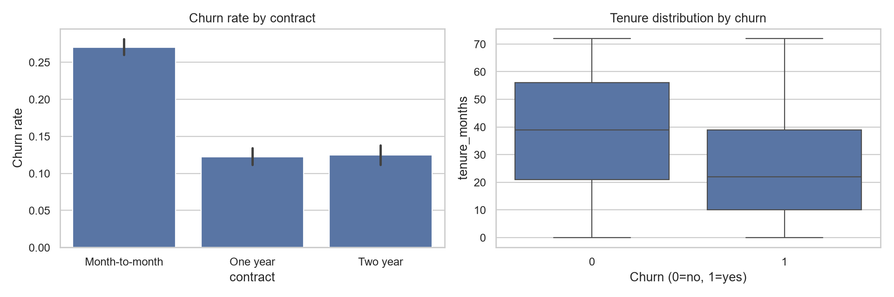

# Customer Churn & Exploratory Data Analysis

An end-to-end churn analysis portfolio project. It generates a reproducible synthetic telecom dataset, cleans it, produces EDA charts, and trains a baseline logistic-regression model.

## Run
```bash
python -m pip install -r requirements.txt
python src/analyze.py
```
Outputs are written to `reports/`. The included data is synthetic and is not presented as a production or client dataset.

## Questions answered
- Which customer segments churn most often?
- How do contract type, tenure, and monthly charges relate to churn?
- How well does a simple, interpretable model identify likely churners?

## Evaluation and interpretation
The stratified 80/20 split reserves 2,400 customers for evaluation. Preprocessing is fitted only on the training set. The baseline test ROC-AUC is 0.763. At a 0.5 threshold, churn recall is only 20%, so the model misses many churners; a retention team would need to tune thresholds using a separate validation set and intervention costs. Accuracy alone is misleading because non-churners dominate the sample.

See `reports/insights.md`, segment rates, coefficients, and the classification report. Synthetic associations illustrate an analysis workflow and do not establish real-world churn drivers or causal effects.


